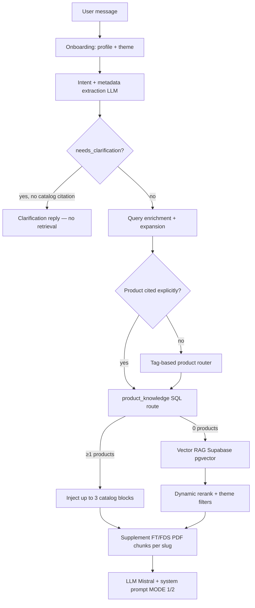

# GEBot Audit — Current State vs. Client Expectations

**Date:** 2026-06-17  
**Scope:** System prompt, RAG retrieval logic, and gap analysis against client feedback  
**Codebase:** `c:\Projets\geb-chatbot` (deployed at `gebot.pn2.geb`)

---

## Scope note

The workspace `extranet_adv` does **not** contain GEBot. The chatbot lives in the sibling repo **`geb-chatbot`** (`POST /api/chat`, widget `gebot-widget.js`). The extranet only provides related product data (MySQL catalog, WordPress PDF lookup) with **no** LLM/RAG layer.

There is **no formal PRD/spec file** in either repo; the closest “target” is the README architecture description plus the three client feedback points below.

### Client feedback (failure modes)

1. Users must be able to ask questions about a **specific product directly**, without needing to specify its overall category (e.g., plumbing vs. swimming pool).
2. The bot fails to answer **general knowledge, application, or FAQ-style questions** accurately, even when the exact phrasing from the FAQ is used.
3. The bot tends to recommend **only a single product**. It should propose **multiple suitable products**, highlighting the pros and cons of each to help the user choose.

---

## Architecture overview (as built)



---

## What has been done (correctly implemented)

### 1. RAG pipeline — solid foundation

| Component | Status | Location |
|-----------|--------|----------|
| **Embeddings** | Mistral `mistral-embed`, batched ingestion | `backend/src/mistral-batched-embedding.ts`, `backend/src/scripts/ingest.ts` |
| **Vector store** | Supabase pgvector via LlamaIndex | `backend/src/services/rag.service.ts` |
| **Chunking** | SentenceSplitter 1200 chars / 120 overlap | `backend/src/scripts/ingest.ts` |
| **Indexed content** | FT + FDS PDFs per product (FR/NL/PL), metadata: `locale`, `theme`, `slug`, `sheet_type`, `audience` | `ingest.ts`, `geb-scraper.service.ts` |
| **Retrieval pool** | `TOP_K=24`, pool ×3 before rerank | `backend/src/config/env.ts` |
| **Hybrid context** | Structured `product_knowledge` blocks + raw PDF chunks | `backend/src/controllers/chat.controller.ts` |
| **Reranking** | Intent-aware dynamic reranker (leak, silicone, exhaust, etc.) | `backend/src/dynamic-reranker.ts` |
| **Fallback chain** | product_knowledge → vector RAG → theme filter retry → locale-only retry | `chat.controller.ts` (~955–1007) |
| **Feedback loop** | 👍/👎 boosts/penalizes slugs, golden/negative examples in prompt | `backend/src/services/feedback-retrieval.service.ts` |
| **Quality gates** | Retrieval regression suite (~20+ golden cases) | `backend/src/config/retrieval-regression-cases.ts` |
| **PDF authority rule** | Prompt: FT/FDS override catalog for compatibility | `backend/src/services/ai.service.ts` |

### 2. Product routing (Phase 2) — intentionally sophisticated

- **`product_knowledge` table**: LLM-synthesized facts per SKU (tags, fluids, materials, advantages, applications).
- **SQL routing** by `use_case_tags` + intent (`resolveUseCaseTags` in `product-router.service.ts`).
- **Explicit product detection**: G-codes, brand names (Gebétanche, MS Zinc, Colmateur…), fiche technique requests (`product-mention.ts`).
- **Direct citation bypass**: named product → skip clarification, inject that SKU’s context.
- **Audience filtering**: pro vs particulier masks incompatible catalog lines (README Phase 4b).

### 3. System prompt — strong on safety and grounding

Implemented in `buildSystemPrompt()` (`backend/src/services/ai.service.ts`):

- **Dual-mode strategy**: MODE 1 (conversational/clarification) vs MODE 2 (structured product block).
- **Chain-of-verification** (internal): compatibility → safety → missing-params gate before MODE 2.
- **Strict grounding**: “Ground every technical claim in retrieved GEB context only.”
- **Product follow-up mode**: short answers without re-dumping the full fiche.
- **Informational FAQ hint**: injected when `isInformationalProductQuestion()` matches.
- **Geo/regulatory policy**: NF DTU gated by country + consent.
- **Feedback learning**: golden Q&A examples + dissatisfied-case warnings in prompt.

### 4. Operational maturity

- SSE streaming chat API, session history, answer cache, analytics, judge service.
- Scrape → synthesize → ingest → regression workflow documented in `README.md`.
- CORS/rate-limit middleware (relevant to 403 on `POST /api/chat` — likely origin/CORS config, not retrieval logic).

### 5. Documented retrieval phases (README)

```
Phase 1 — product_knowledge : synthèse batch des FT (~217 produits FR)
Phase 2 — Routage SQL par tags/intent avant le RAG vectoriel
Phase 3 — Feedback + judge + tests de régression (npm run retrieval-regression)
Phase 4 — VECTOR_RAG_LITE=auto : repli vectoriel sans patchs scénario
Phase 4b — Routage catalogue tient compte du profil (pro/particulier)
```

---

## Gap analysis — why the bot fails the 3 client points

### Gap 1 — Ask about a specific product without specifying category

**Target:** User says *“What is MS Zinc?”* or *“Can I use G60 on aluminium?”* without picking a domain first.

#### What works today

- Explicit product mention detection (`mentionsLikelyProductPhrase`, `EXPLICIT_CATALOG_PRODUCT_PATTERNS`, G-code extraction).
- `catalog_citation_bypass` clears `needs_clarification` when a product is matched.
- `factualProductMode` routes to a **single** cited product without tag routing.
- Theme fallback: vector search retries **without** theme filter if `< 3` results.

#### What blocks or degrades this

| Mechanism | Effect |
|-----------|--------|
| **Mandatory theme onboarding** | After profile, user must pick domain (`THEME_QUESTION_BY_LOCALE`) before free questioning (`chat.controller.ts` ~314–363). |
| **Theme as hard filter** | Vector RAG applies `theme == effectiveTheme` in metadata filters (`preFilters`, ~818–838). Wrong/missing theme → wrong or empty chunks. |
| **SQL theme filter** | `fetchCandidates()` does `.eq("theme", theme)` when theme is set (`product-knowledge.service.ts` ~573–575). |
| **Scoring penalty** | Wrong theme: **−20**; same theme: **+6** (`scoreProduct`, ~120–121). Cross-category products are heavily suppressed even if retrieved. |
| **Limited name matching** | `extractNameSearchTerms` + ILIKE; works for known families, weak for obscure SKU names or partial references not in pattern lists. |
| **Regression tests assume theme** | All golden cases in `retrieval-regression-cases.ts` include a `theme` field — cross-category direct lookup is **not** a tested path. |

#### Root cause

The architecture treats **domain/theme as a first-class routing dimension**, not an optional hint. Direct product lookup exists but is **narrow** (regex + score thresholds ≥ 40–48). Generic “tell me about product X” without theme or without a strong name match falls through to tag routing or vector search under the wrong theme filter.

---

### Gap 2 — FAQ / general knowledge / application questions fail (exact phrasing)

**Target:** Questions like *“How long does silicone take to dry?”*, *“Can I paint over Exthane?”*, application steps, general GEB FAQ copy.

#### What works today

- `isInformationalProductQuestion()` detects many factual patterns (colors, drying, compatibility…).
- Prompt injection: `TYPE_QUESTION: informational_faq — MODE 1: réponds DIRECTEMENT…`
- MODE 1 instructions: answer application/how-to from FT/FDS before recommending.
- PDF chunks can contain application text **if** the right product PDF was retrieved.

#### What blocks or degrades this

| Mechanism | Effect |
|-----------|--------|
| **No FAQ corpus** | Ingestion indexes **PDFs only** (`ingest.ts` — FT/FDS from scraper or WP media). WordPress FAQ pages, posts, help articles are **not** ingested. Exact FAQ phrasing cannot match if that text isn’t in the index. |
| **Clarification short-circuit** | If `needs_clarification && !hasCatalogCitation`, the bot returns a diagnostic question **before any retrieval** (~585–616). FAQ-style open questions often trigger `missing_params` (especially fluid/joint_service_fluid). |
| **Retrieval is product-centric** | `product_knowledge` synthesis focuses on SKU specs, not standalone FAQ Q&A pairs. |
| **Semantic gap** | FAQ prose ≠ PDF technical sheet prose; embedding similarity is low even when the answer exists on the website. |
| **No hybrid BM25** | Pure vector + lexicon rerank; no keyword/exact-match layer for FAQ sentences. |
| **Empty context → hard fail** | `retrievalCount === 0` → generic “je ne trouve pas d’info technique” (`NO CONTEXT FALLBACK`), regardless of FAQ intent hint. |

#### Root cause

The knowledge base is **product datasheet–shaped**, not **FAQ-shaped**. The prompt has FAQ *behavior* instructions, but the **retrieval layer cannot find FAQ content** that was never indexed. Exact phrasing failure is expected, not accidental.

---

### Gap 3 — Recommends only one product; should propose several with pros/cons

**Target:** When multiple SKUs fit, present 2–3 options with trade-offs to help the user choose.

#### What works today

- Retrieves up to **`PRODUCT_KNOWLEDGE_MAX_PRODUCTS=3`** catalog blocks.
- Each block includes `Avantages`, `Applications`, `Garde` (warnings) in context (`formatProductKnowledgeContext`).
- Prompt allows: *“briefly mention alternatives in the MODE 2 closing sentence.”*
- Optional **one** complementary product via `COMPLEMENTARY_HINTS` (PTFE tape, surface cleaner…).

#### What explicitly prevents multi-product comparison

| Mechanism | Effect |
|-----------|--------|
| **System prompt mandate** | *“Recommend EXACTLY ONE primary product”* (`ai.service.ts` ~133). |
| **MODE 2 template** | Single block: `### 📦 Produit Recommandé : **[NOM DU PRODUIT]**` — no multi-product structure. |
| **Brevity cap** | MODE 2: opening 1 sentence + max 2-line description + 4 bullets — no room for comparison. |
| **LLM token cap** | `MISTRAL_CHAT_MAX_TOKENS=720` limits long comparative answers. |
| **Routing returns ranked list, prompt picks one** | Router returns top 3 by score; prompt instructs LLM to choose **most specific** only. |
| **No comparison schema** | No `### Options comparées`, no pros/cons table, no “Option A vs B” in prompt or post-processing. |
| **Analytics assumes single SKU** | `recommendedProduct` field logs one product per turn. |

#### Root cause

Multi-product retrieval exists at the **data layer** (top-3), but the **prompt and response contract are explicitly single-product by design**. Alternatives are an afterthought in one closing sentence, not a first-class UX requirement.

---

## Summary matrix

| Client requirement | Spec / intent | Implemented? | Primary blocker |
|------------------|---------------|--------------|-----------------|
| Direct product Q without category | User names SKU → accurate answer | **Partial** | Theme onboarding + theme filters/penalty; narrow explicit-name matching |
| FAQ / application / general knowledge | Answer from knowledge base, exact FAQ OK | **Weak** | FAQ content not indexed; clarification gate; product-PDF-only corpus |
| Multiple products + pros/cons | Compare suitable options | **No (by design)** | Prompt mandates exactly one product; single MODE 2 template |

---

## Architectural observations (for next decisions)

### Strengths to preserve

- Hybrid catalog + PDF retrieval
- Intent routing
- Feedback loop
- Regression tests
- Grounding discipline
- Pro/particulier catalog filtering

### Likely improvement axes (decision points — not implemented)

1. **Product without category**
   - Treat theme as **soft boost**, not SQL/vector hard filter, when explicit product citation score ≥ threshold.
   - Allow cross-theme retrieval with mismatch disclaimer (partially exists in prompt, contradicted by filters).

2. **FAQ**
   - Ingest a dedicated **`faq` document type** (WP pages, help center, curated Q&A JSON) with question-title metadata.
   - Add **hybrid retrieval** (BM25 + vector) for exact phrasing.
   - Bypass clarification for `general_technical` / `product_info` intents when FAQ chunks match.

3. **Multi-product**
   - New **MODE 3 — COMPARISON** in prompt + response template.
   - Raise `PRODUCT_KNOWLEDGE_MAX_PRODUCTS` when comparison mode triggers.
   - Inject structured pros/cons from `advantages` / `warnings` fields.
   - Trigger when router score spread is tight (multiple candidates within Δ score).

### Suggested prioritization

**FAQ ingestion + clarification bypass** first — unblocks the widest class of “exact phrasing” failures without fighting the single-product prompt contract.

---

## Key files reference

| Area | Key files |
|------|-----------|
| System prompt | `backend/src/services/ai.service.ts` |
| Chat orchestration | `backend/src/controllers/chat.controller.ts` |
| Vector + hybrid retrieval | `backend/src/services/rag.service.ts` |
| Catalog SQL routing | `backend/src/services/product-knowledge.service.ts`, `product-router.service.ts` |
| Intent / clarification gates | `backend/src/intent-extractor.ts` |
| Product mention / citation | `backend/src/utils/product-mention.ts` |
| Informational question detection | `backend/src/utils/text.ts` |
| Ingestion scope | `backend/src/scripts/ingest.ts`, `geb-scraper.service.ts` |
| Config knobs | `backend/src/config/env.ts`, `backend/src/config/constants.ts` |
| Golden tests | `backend/src/config/retrieval-regression-cases.ts` |
| Dynamic reranker | `backend/src/dynamic-reranker.ts` |

---

## Related: extranet_adv (no GEBot code)

The B2B extranet provides product data that could feed a future integration but does not implement chat/RAG:

| extranet capability | Relevance to GEBot |
|---------------------|-------------------|
| `Product` schema (category, family, code, descriptions) | Structured metadata exists; not wired to chatbot |
| Catalog search (name substring only) | Not semantic; name-only match |
| `productDocumentationService.js` | WordPress PDF URL lookup; not FAQ |
| `GET /api/products/related` | Category/family filters; max 12 products; no comparison rationale |
| Human support tickets | No AI replies |

GEBot deployment is independent: `geb-chatbot/frontend/dist/gebot-widget.js` → `geb-chatbot` backend on port 8787 (default).
